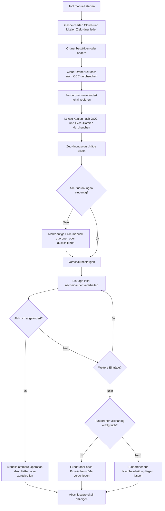

# Fachlicher Ablauf

## Hauptablauf

## 1. Cloud-Quelle und lokales Ziel

- Nach dem manuellen Start werden der zuletzt gültige Cloud-Quellordner und der zuletzt gültige lokale Zielordner angezeigt.
- Der Benutzer kann beide Ordner in der GUI ändern.
- Beide Einstellungen werden erst gespeichert, nachdem die Ordner gültig und zugreifbar sind.
- Der Cloud-Scan startet bewusst durch den Benutzer, nicht automatisch beim Öffnen der GUI.
- Die Cloud-Quelle wird nur gelesen. Das Tool verändert, verschiebt oder löscht dort weder Dateien noch Ordner.

## 2. Cloud-Suche und lokale Kopie

- Der Cloud-Quellordner und alle Unterordner werden nach `*.occ`-Dateien durchsucht.
- Ordner mit dem Namensbestandteil `erledigt` werden beim Cloud-Scan einschließlich aller Unterordner ausgeschlossen.
- Ordner mit dem Präfix `zz_` werden ebenfalls einschließlich aller Unterordner ausgeschlossen.
- Jeder Ordner, der mindestens eine `*.occ`-Datei enthält, wird einschließlich seines Inhalts in den lokalen Zielordner kopiert.
- Die relative Ordnerstruktur unterhalb des Cloud-Quellordners bleibt im lokalen Ziel erhalten, damit gleichnamige Fundordner aus unterschiedlichen Bereichen getrennt bleiben.
- Bereits bestehende Dateien im lokalen Ziel werden nicht ungeprüft überschrieben. Konflikte werden angezeigt und müssen vom Benutzer entschieden werden.
- Fehler beim Lesen oder Kopieren werden mit Quell- und Zielpfad protokolliert; die Cloud-Daten bleiben unverändert.
- Alle folgenden Schritte arbeiten ausschließlich mit den lokalen Kopien.
- Der Unterordner `Protokollentwürfe` ist ebenfalls von Cloud-Kopie und lokaler Suche ausgeschlossen.

## 3. Rekursive lokale Suche

- Der lokale Zielordner und alle neu bereitgestellten Unterordner werden durchsucht.
- Unterordner mit `erledigt` im Namen, mit Präfix `zz_` sowie `Protokollentwürfe` werden nicht weiter traversiert.
- Gesucht werden mindestens `*.occ`, `*.xlsx` und gegebenenfalls `*.xlsm`.
- Temporäre Excel-Dateien wie `~$Datei.xlsx` werden ignoriert.
- Nicht lesbare Ordner werden protokolliert, ohne den gesamten Scan zwingend abzubrechen.
- In sehr großen Teilbäumen kann die Fortschrittsanzeige sichtbar langsamer aktualisieren, obwohl der Scan weiterläuft.

## 4. Vorschau

Die Vorschau zeigt pro geplanter Verarbeitung:

- Unterordner,
- Omicron-Datei,
- vorgeschlagene Excel-Datei,
- Status der Zuordnung,
- gegebenenfalls Begründung oder Warnung.

Mögliche Statuswerte:

- `Eindeutig`: genau eine belastbare Zuordnung gefunden
- `Auswahl erforderlich`: mehrere Excel-Ziele kommen infrage
- `Excel fehlt`: keine geeignete Excel-Datei gefunden
- `OCC fehlt`: nur für Vollständigkeitsprüfungen relevant
- `Ausgeschlossen`: vom Benutzer bewusst nicht zur Verarbeitung gewählt

## 5. Zuordnung

Ein Ordner kann mehrere `*.occ`- und mehrere Excel-Dateien enthalten, beispielsweise je eine Kombination pro Trafostation. Deshalb darf die Anzahl oder alphabetische Reihenfolge allein keine endgültige Zuordnung bestimmen.

Für die zweite Station ist folgende Namensregel bestätigt:

- Der Dateiname enthält an beliebiger Stelle `EZE`.
- Die Erkennung ignoriert Groß-/Kleinschreibung; `EZE`, `eze` und `Eze` sind gleichwertig.
- Eine EZE-markierte `*.occ`-Datei wird einer EZE-markierten Excel-Datei zugeordnet, wenn auf beiden Seiten genau ein Kandidat vorhanden ist.
- Fehlt ein passender EZE-Kandidat oder gibt es mehrere Kandidaten, ist die Zuordnung nicht eindeutig.

Zusätzlich gilt:

- Eine einzelne `*.occ` plus eine einzelne Excel-Datei im fachlichen Ordner ist eindeutig.
- Mehrere `*.occ`-Dateien plus genau eine Excel-Datei sind ebenfalls eindeutig: Alle gefundenen Prüfungen werden in diese gemeinsame Arbeitsmappe übernommen.
- In diesem gemeinsamen Ziel kennzeichnet `EZE` die zweite Station beziehungsweise deren Datenbereich.
- Die EZE-Regel wird erst zur Auswahl eines Excel-Ziels verwendet, wenn mehrere geeignete Excel-Dateien vorhanden sind.
- Bei mehreren möglichen Excel-Dateien ist eine sichtbare Auswahl erforderlich.
- Die manuelle Auswahl erfolgt pro OCC-Datei in der GUI als OCC->Excel-Zuordnung.
- Der Start der Verarbeitung ist gesperrt, solange ein Ordner ungeklärte Zuordnungen hat.
- Optional kann sich das Tool später bestätigte Namensmuster merken.

## 6. Verarbeitung

Die Einträge werden nacheinander verarbeitet. Für jeden Eintrag:

1. Quelldatei und Ziel erneut auf Existenz und Zugriff prüfen.
2. Vor der Gruppe den Mashup-Loader kontrolliert beenden.
3. Messdaten aus den zugeordneten `*.occ`-Dateien nacheinander exportieren.
4. Ziel-Excel sicher öffnen.
5. Daten in die vorgesehenen Bereiche übernehmen.
6. Ergebnis sicher speichern.
7. Status und Fehlermeldung protokollieren.

Ein Fehler in einem Eintrag soll standardmäßig die übrigen eindeutigen Einträge nicht verhindern.

Für den Nachtlauf gilt zusätzlich:

- Der Lauf verarbeitet weitere Einträge trotz Fehlern einzelner Ordner.
- Fehler und übersprungene Einträge werden gesammelt.
- Am Ende wird ein Fehlerbericht als JSON-Datei im Arbeitsbereich ausgegeben.

Nach Abschluss aller Einträge eines Fundordners:

- Sind alle zugehörigen Einträge erfolgreich, wird der vollständige lokale Fundordner nach `<lokaler Arbeitsordner>/Protokollentwürfe` verschoben.
- Fehlgeschlagene, abgebrochene, ausgeschlossene oder nicht gestartete Einträge verhindern das Verschieben. Der Fundordner bleibt dann im Arbeitsordner sichtbar zur Nachbearbeitung.
- Ein bereits bestehender gleichnamiger Zielordner wird nicht überschrieben; der Verschiebekonflikt wird angezeigt und protokolliert.

Der Omicron-Export erfolgt durch sichtbare Bedienung der Anwendung. Vor dem Start weist das Tool deshalb deutlich darauf hin, dass während der aktiven Verarbeitung in derselben Windows-Sitzung keine Maus-, Tastatur- oder Fokuswechsel erfolgen dürfen. Die Vorschau und alle manuellen Zuordnungen werden abgeschlossen, bevor die sichtbare Automatisierung beginnt.

Soll der Arbeitsplatz parallel nutzbar bleiben, muss die Verarbeitung in einer separaten Windows-Sitzung, virtuellen Maschine oder auf einem zweiten Rechner ausgeführt werden.

### Kunden aus Terminexcel übernehmen

Vor der Excel-Nachverarbeitung:

1. Im Blatt `Schutzprüf-Checkliste` den angehakten Prüfer aus den Checkboxen über Zeile 5 lesen.
2. Das Prüfdatum aus `Schutzprüf-Checkliste!B7` lesen.
3. In der Terminexcel nach der Kombination aus Prüfer und Datum suchen.
4. Bei genau einem Treffer den Wert der Spalte `Kunde` lesen.
5. Den Wert mit der Kundenliste `Kunden!A1:A35` der Prüfdaten-Arbeitsmappe abgleichen.
6. Den eindeutigen vollständigen Kundeneintrag nach `Allgemeine Angaben!C2` schreiben.
7. Bei mehreren Treffern die Verarbeitung anhalten und eine manuelle Auswahl verlangen.
8. Bei keinem Treffer die Verarbeitung anhalten und eine manuelle Eingabe verlangen.

Dabei gilt:

- Der Datumsvergleich erfolgt ohne Uhrzeitanteil.
- Der Kundenabgleich gegen `Kunden!A1:A35` erfolgt exakt.
- Interne oder Abwesenheitseinträge wie `urlaub`, `elternzeit`, `intern`, `ges intern`, `schulung`, `krank`, `büro`, `homeoffice` werden nicht automatisch übernommen.

Die Kundenzuordnung muss vor `Protokollnummer_generieren_unsichtbar` erfolgen, weil dieses Makro den Kunden aus `Allgemeine Angaben!C2` in die zentrale Protokollübersicht übernimmt.

## 7. Abbruch

- Während der Verarbeitung ist ein robuster Abbruchmechanismus verfügbar, der die sichtbare Omicron-Bedienung kontrolliert beendet.
- Ein Abbruch stoppt vor dem nächsten Eintrag.
- Eine bereits begonnene Schreiboperation wird entweder vollständig abgeschlossen oder zurückgerollt.
- Bereits erfolgreich verarbeitete Einträge bleiben erfolgreich.
- Nicht gestartete Einträge erhalten den Status `Abgebrochen`.

## 8. Abschluss

Die Ergebnisansicht zeigt mindestens:

- erfolgreich verarbeitet,
- mit Fehler beendet,
- übersprungen,
- durch Benutzer abgebrochen,
- Gesamtlaufzeit,
- Speicherort des Fehlerberichts bei Fehlern oder Skip-Fällen.
